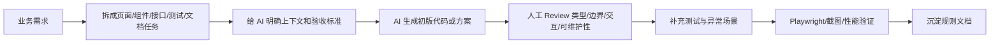

# AI 协作开发经验模板

用途：投递 AI Native 前端岗位、准备面试、整理“过去半年用 AI 完成的前端事项”。

注意：下面的示例只能作为表达模板。最终投递时要替换成你真实做过的项目、工具和结果。

## 1. AI 协作流程



## 2. 需求拆解 Prompt 模板

```text
你是一个资深前端工程师。请把下面需求拆成可执行任务，要求每个任务都包含：
1. 目标
2. 涉及文件或模块
3. 输入输出
4. 交互状态
5. 异常场景
6. 验收标准

技术栈：
- Vue3/React + TypeScript
- Vite
- 组件库：Element Plus/Ant Design
- 状态管理：Pinia/Zustand

需求：
【粘贴需求】
```

## 3. AI 代码 Review 清单

| 检查项 | 要看什么 | 常见问题 |
| --- | --- | --- |
| 类型 | 是否有 any、接口类型是否准确、泛型是否合理 | API 响应类型随便写，表单类型和真实字段不一致 |
| 状态 | loading、error、empty、success 是否完整 | 只处理成功态，不处理失败和空数据 |
| 权限 | 菜单、路由、按钮是否都受控 | 只隐藏按钮，接口或路由仍可访问 |
| 接口 | 错误码、401、取消请求、重复提交是否处理 | 页面里散落大量 try/catch |
| 组件 | Props 是否清晰，是否有副作用，是否过度耦合业务 | 一个组件同时管查询、表格、弹窗、接口 |
| 性能 | 是否重复渲染，是否大数据直接渲染，是否有懒加载 | 列表一次渲染全部数据 |
| 可维护性 | 命名、目录、复用边界是否符合规范 | 生成代码能跑但结构混乱 |
| 测试 | 是否覆盖关键流程和异常场景 | 只有快照或没有真实交互测试 |

## 4. Playwright 验收用例模板

```text
请为下面页面设计 Playwright E2E 用例，至少覆盖：
1. 正常登录/进入页面
2. 查询条件筛选
3. 新增或编辑表单
4. 表单校验失败
5. 接口失败提示
6. 无权限按钮不可见
7. 空数据展示
8. 页面刷新后状态恢复

页面说明：
【粘贴页面说明】

接口约定：
【粘贴接口或 Mock 说明】
```

## 5. 性能诊断 Prompt 模板

```text
我有一个前端页面出现卡顿。请帮我设计性能排查步骤，要求包含：
1. Chrome Performance 需要观察哪些指标
2. 如何判断是 JS 长任务、重复渲染、网络请求还是布局问题
3. 如何记录优化前后数据
4. 可尝试的优化方案
5. 哪些方案可能有副作用

页面场景：
【粘贴页面场景】
```

## 6. AI 常犯错误沉淀

| 错误类型 | 表现 | 修正规则 |
| --- | --- | --- |
| 忽略异常态 | 只写成功流程 | 每个接口必须有 loading、error、empty 三种状态 |
| 类型不严谨 | any 泛滥 | API 和组件 Props 必须显式建模 |
| 过度封装 | 为简单逻辑创建复杂抽象 | 只有跨 2 个以上场景复用才抽公共组件 |
| 假设接口存在 | 编造字段或接口 | 所有字段以接口文档或 Mock 为准 |
| 权限不完整 | 只做前端隐藏 | 路由、菜单、按钮、接口错误都要处理 |
| 测试太浅 | 只检查元素存在 | 必须覆盖用户真实操作路径 |
| 样式不稳定 | 小屏溢出、按钮文字换行异常 | 每个页面至少检查桌面和移动宽度 |
| 性能盲区 | 大列表直接 map 渲染 | 超过阈值要考虑分页、虚拟滚动或懒加载 |

## 7. 不超过 200 字回答模板

模板：

```text
过去半年我用 AI 最有价值的一件事是：【项目/模块】中把【需求】拆成组件、接口、测试和文档任务，使用【工具】生成初版代码，再由我负责类型、边界、权限、异常态和性能 Review，并用【验证方式】验收，最终沉淀了【规范/清单】。我认为 AI 最不靠谱的是【问题】，例如【例子】，所以我不会直接合并 AI 代码，而是要求它满足明确的接口契约、测试用例和 Review 清单。
```

偏 AI Native 岗位示例：

```text
过去半年我用 AI 最有价值的是把中后台模块拆成页面、组件、接口、测试和文档任务，用 Codex/Cursor 生成初版，再人工审查类型、权限、异常态和可维护性，并用 Playwright 验收。AI 最不靠谱的是会编造接口字段、忽略异常场景，所以我会先给契约和验收标准，再做 Review 和测试。
```

偏性能岗位示例：

```text
我用 AI 辅助整理性能排查路径和重构方案，但瓶颈判断由我基于 Performance 面板完成。最有价值的是把长列表卡顿问题拆成数据渲染、重复计算和组件更新几类验证项。AI 不靠谱的是容易给通用建议，所以我会要求它围绕真实指标、截图和代码路径输出方案。
```

## 8. 面试回答结构

回答 AI 协作问题时，按这个顺序讲：

1. 场景：什么项目、什么模块、什么问题。
2. 拆解：你怎么把需求拆给 AI。
3. 约束：你给了哪些接口、类型、规范和验收标准。
4. 审查：AI 产出哪里错了，你怎么发现。
5. 验收：用什么测试、截图或性能数据证明可用。
6. 沉淀：最后形成了什么规则，下一次如何提高效率。

## 9. 可以放进简历的表达

- 使用 Codex/Cursor/Claude Code 辅助前端模块开发，将业务需求拆解为组件、接口、测试和文档任务。
- 建立 AI 代码 Review 清单，重点检查类型建模、异常态、权限边界、组件复用和性能风险。
- 结合 Playwright 完成登录、权限、列表、表单、异常态等核心流程自动化验收。
- 将 AI 反复出错的问题沉淀为开发规范，提升后续生成代码的一致性和可维护性。

