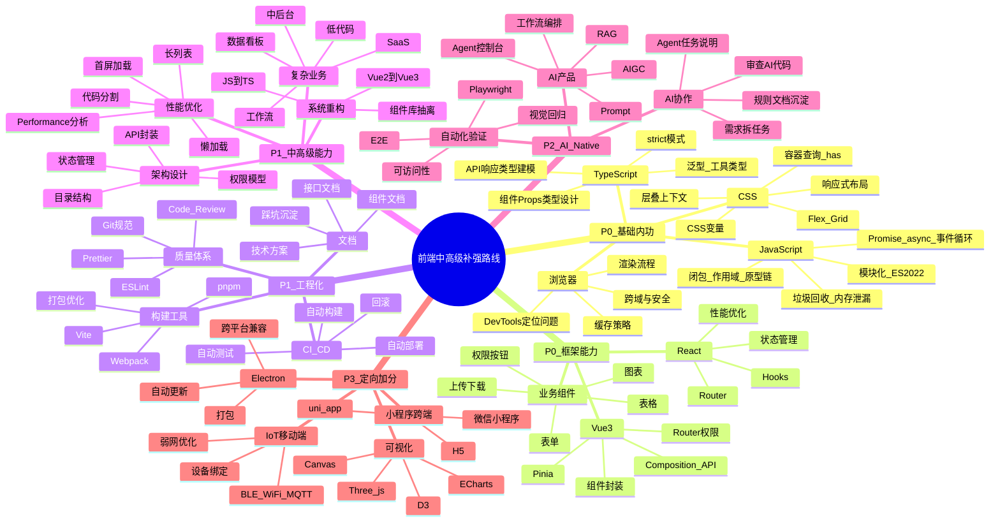

# 前端岗位能力补强路线图

这份路线图基于 `岗位要求.md` 和 `高级岗位要求.md` 中的前端岗位要求整理，目标是服务 **中高级前端 / 前端偏全栈 / AI Native 前端** 投递。

使用方式：

- 先补 P0，保证面试基础不丢分。
- 再做 P1，把自己从“业务开发”升级成“模块负责人 / 系统负责人”。
- P2 作为差异化竞争力，尤其适合 AI Native 前端岗位。
- P3 不建议全学，按目标岗位选择。

## 1. 岗位能力画像

| 岗位类型 | 重点要求 | 典型面试追问 | 简历要体现 |
| --- | --- | --- | --- |
| 普通前端 | 页面开发、接口联调、组件封装、业务迭代 | 你负责过哪些页面？怎么和后端联调？怎么处理权限？ | 独立完成模块、稳定交付、技术栈匹配 |
| 中级前端 | Vue/React 熟练、TS、工程化、性能优化、文档 | 你怎么封装组件？怎么处理复杂表单？怎么排查线上问题？ | 组件复用、工程规范、业务复杂度 |
| 高级前端 | 架构设计、重构、性能体系、组件库、质量保障 | 为什么这么设计？遇到瓶颈怎么定位？如何推动团队规范？ | 负责系统、主导方案、指标结果 |
| 前端偏全栈 | Node.js、Mock、BFF、AI API 调用、接口契约 | 你写过哪些后端接口？怎么设计前后端协议？ | 页面到接口完整跑通、Node 中间层 |
| AI Native 前端 | AI agent 协作、代码审查、自动化验证、性能诊断 | 你怎么拆任务给 AI？怎么判断 AI 代码可用？ | AI 协作流程、验收体系、沉淀规范 |

## 2. 思维导图

## 3. P0 必补：基础与框架

| 能力域 | 常见不足表现 | 学习目标 | 练习任务 | 可写进简历的证明 |
| --- | --- | --- | --- | --- |
| JavaScript 基础 | 能写业务，但闭包、原型、事件循环讲不清 | 能解释异步执行顺序、this、原型链、模块加载 | 每天 5 道 JS 输出题；手写防抖、节流、并发请求控制、深拷贝 | “扎实掌握 JS 异步、闭包、原型链及模块化机制” |
| TypeScript | 只会给变量标类型，复杂接口全用 any | 能为 API、表单、组件 Props 建模 | 把一个已有页面改成 strict TS；封装 `ApiResponse<T>`、分页类型、表单类型 | “基于 TypeScript 完成接口类型建模与组件类型约束” |
| CSS | 页面能还原，但复杂布局、层叠问题排查慢 | 能快速处理响应式、Grid、层叠上下文、主题变量 | 做一个后台布局：侧栏、顶部栏、内容区、暗色主题、移动适配 | “使用 CSS 变量、Flex/Grid 完成响应式中后台布局” |
| 浏览器 | 性能问题只会猜，不会定位 | 能用 DevTools 定位长任务、重排、内存泄漏、网络瓶颈 | 录制 Performance；找出长任务；用 Memory 查定时器/事件未释放问题 | “使用 Chrome DevTools 定位并优化页面渲染与内存问题” |
| Vue3 | 只会 Options API 或简单 Composition API | 能设计组件边界、状态管理、路由权限、异步加载 | 做 Vue3 后台：登录、菜单、权限、表格、表单、图表 | “基于 Vue3 + TS + Pinia 搭建中后台基础框架” |
| React | Hooks 能用但优化和状态管理不稳 | 能掌握 Hooks 规则、memo、状态管理、组件抽象 | 做 React 数据看板：查询、筛选、图表、详情弹窗 | “基于 React + TS 封装可复用业务组件与数据看板模块” |

## 4. P1 强化：工程化、中高级能力

| 能力域 | 学习重点 | 练习任务 | 面试讲法 |
| --- | --- | --- | --- |
| 工程化 | Vite、Webpack、pnpm、环境变量、打包分析 | 为项目配置多环境、路径别名、按需加载、打包体积分析 | “我不仅做页面，也维护构建和发布链路” |
| 代码质量 | ESLint、Prettier、Husky、Commit 规范、Review 清单 | 建一个提交前检查流程，阻止 lint/test 失败的提交 | “通过工具把团队规范前置到开发阶段” |
| API 封装 | Axios/fetch 封装、错误处理、取消请求、重试、统一提示 | 封装 request 层，覆盖 token、401、业务错误、loading | “统一接口层，降低页面重复逻辑” |
| 权限模型 | 登录态、菜单权限、路由权限、按钮权限、数据权限 | 做 RBAC：用户、角色、菜单、按钮权限 | “从路由、菜单、按钮三个层级实现权限控制” |
| 性能优化 | 首屏、长列表、懒加载、代码分割、缓存、图片优化 | 做一个 5000 行列表卡顿优化案例，记录优化前后指标 | “能用数据证明优化效果，而不是只说做过优化” |
| 组件库 | 表格、表单、弹窗、上传、权限按钮、图表组件 | 抽出业务组件并写使用文档和示例 | “沉淀通用组件，提高复用率与维护效率” |
| 重构能力 | Vue2 到 Vue3、JS 到 TS、老项目工程化、组件抽离 | 选一个旧页面，重构为组件化 + TS + 统一接口 | “在不影响业务迭代的前提下渐进式重构” |

## 5. P2 差异化：AI Native 前端

AI Native 岗位真正看重的不是“会不会用 AI 工具”，而是你能不能把 AI 纳入稳定研发流程。

| 能力域 | 学习目标 | 练习任务 | 产出物 |
| --- | --- | --- | --- |
| 任务拆解 | 把业务需求拆成 AI 可执行的小任务 | 将“用户管理模块”拆成页面、接口、组件、测试、文档任务 | `AI任务拆解.md` |
| 代码审查 | 能判断 AI 代码是否符合项目规范、是否有边界问题 | 让 AI 写一个表格页，你从类型、状态、错误处理、可维护性做 Review | `AI代码Review清单.md` |
| 自动化验收 | 用 Playwright 验证登录、权限、列表、表单、异常态 | 为 Vue/React 项目写 8-12 条 E2E 用例 | `tests/e2e/*.spec.ts` |
| 性能证明 | 用 Performance 面板证明优化效果 | 记录优化前后长任务、FPS、首屏时间、包体积 | `性能优化案例.md` |
| 规则沉淀 | 把 AI 常犯错转成规则文档 | 总结 10 条 AI 生成前端代码常见问题和修正策略 | `AI协作规范.md` |

AI Native 面试高频问题：

- 你过去半年用 AI 做过最有价值的一件前端事是什么？
- AI 生成代码最不靠谱的地方是什么？
- 你怎么判断 AI 写的代码能不能进项目？
- 你会把哪些任务交给 AI，哪些必须自己做？
- 如果 AI 反复在同类问题上出错，你怎么处理？

## 6. P3 定向加分：按岗位选择

| 方向 | 适合岗位 | 只需补到什么程度 | 不建议投入 |
| --- | --- | --- | --- |
| 小程序 / uni-app | 小程序、跨端、移动端岗位 | 能做登录、分包、接口、列表、表单、兼容适配 | 不必深挖所有平台差异 |
| IoT / 家电 / 设备控制 | 家电、机器人、智能硬件岗位 | 理解 BLE/WiFi/MQTT、设备绑定、弱网、OTA 基本流程 | 不必变成嵌入式工程师 |
| Electron | 桌面端、工具软件岗位 | 了解主进程/渲染进程、打包、自动更新、跨平台兼容 | 不必同时深学 Angular |
| 可视化 / Three.js | 数据看板、3D、WebGL 岗位 | ECharts 熟练；Three.js 有一个可展示 Demo | 不必一开始研究底层渲染 |
| Node 轻后端 | 前端偏全栈、AI 应用岗位 | 能写 Mock、BFF、AI API 调用、SSE 流式输出 | 不必完整学习大型后端架构 |

## 7. 16 周执行路线

| 周期 | 重点 | 每周任务 | 产出 |
| --- | --- | --- | --- |
| 第 1-2 周 | JS + TS 基础补强 | JS 输出题、事件循环、TS 泛型与工具类型、接口类型建模 | `xue/js.md`、`xue/ts.md` 补充笔记 |
| 第 3-4 周 | Vue3 + TS 项目骨架 | 登录、路由、Pinia、权限、接口封装、布局 | Vue3 中后台项目初版 |
| 第 5-6 周 | React + TS 项目骨架 | Hooks、Router、状态管理、Ant Design、图表 | React 数据看板初版 |
| 第 7-8 周 | 业务组件沉淀 | 查询表单、高级表格、权限按钮、上传、弹窗、图表组件 | 组件文档 + 示例页面 |
| 第 9-10 周 | 性能优化案例 | 长列表、首屏优化、代码分割、图片懒加载、缓存 | 性能优化前后对比报告 |
| 第 11-12 周 | 工程化与质量 | ESLint、Prettier、Husky、CI、Playwright E2E | 自动化测试与质量门禁 |
| 第 13-14 周 | AI Native 工作流 | 用 AI 拆任务、写代码、Review、补测试、沉淀规则 | AI 协作开发文档 |
| 第 15-16 周 | 简历与面试材料 | 项目复盘、STAR 表达、面试题整理、投递话术 | 简历项目描述 + 200 字 AI 回答 |

## 8. 每周固定节奏

- 周一：确定本周主题和可交付成果。
- 周二到周四：学习 + 编码，每天至少完成一个小功能或一组题。
- 周五：写文档，记录问题、方案、踩坑和指标。
- 周六：模拟面试讲项目，录音或写成文字。
- 周日：复盘，整理简历表达和下周计划。

## 9. 简历表达升级模板

| 原表达 | 升级表达 |
| --- | --- |
| 参与页面开发 | 独立负责 XX 模块的方案设计、前端开发、接口联调、测试与上线 |
| 熟悉 Vue/React | 基于 Vue3/React + TypeScript 搭建中后台项目，并封装通用业务组件 |
| 做过性能优化 | 通过代码分割、懒加载、虚拟滚动、缓存策略，将首屏/列表交互性能优化到可量化指标 |
| 使用 AI 工具 | 使用 Codex/Cursor/Claude Code 拆解需求、生成代码、审查产出，并结合 Playwright 完成自动化验收 |
| 写过组件 | 抽象查询表单、高级表格、权限按钮、上传等业务组件，沉淀使用文档并提升复用率 |

## 10. 学习验收标准

每个方向都按“能不能证明”验收：

- 能讲清楚原理：不是背概念，而是能结合项目说为什么。
- 有代码产物：至少有一个可运行页面或组件。
- 有文档沉淀：问题、方案、取舍、风险、结果写清楚。
- 有指标证明：性能、包体积、错误率、复用率、测试覆盖至少选一个。
- 能写进简历：每个学习点最终都要转成项目经历或技术亮点。

